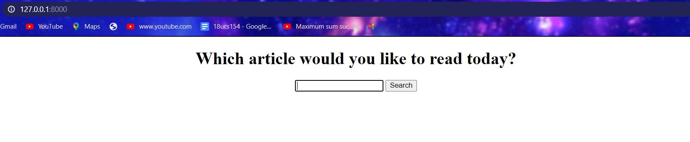

# B.Tech. Project

## Problem Statement

Create a web application/site that extracts only relevant articles on the provided query. In addition, also provide the user the choice to save those articles on their respective google drive.

## Tech Stack

1. Python: Primary programming language
2. BeautifulSoup: Python package for parsing HTML and XML documents
3. Django: Web framework that follows the model-template-views architectural pattern
4. External API: Google-Cloud API (for storing data)

## Approach

This is a Website which can be used by an individual who is looking for recent articles on particular topic. Only those articles are shown to the user which are been published by Authors thus signifying the authenticity of the Articles. The user has to provide just one field in the search box: -

    - Keyword/Topic to be searched

## How to setup and run the website
- Clone the repository from github (https://github.com/rishitsahu/BTP)
- Extract all the files from the folder in a fresh folder.
- Open the folder showing all the files of the project.
- Open powershell windows in that folder by following command:
     Shift+Right Click -> Click on open powershell
- Now run the following commands
     virtualenv myenv (creating virtual environment)
     . myenv/Scripts/activate
     pip install -r requirements.txt
     python manage.py runserver
 - Website is ready now at port number 8000

## Website Schema
```
 |__website main page
            |___ keyword to be found
                                    |____Article 1
                                    |____Article 2
                                    |____Article 3
                                    |____Article 4
                                    .
                                    .
                                    .
                                    |____Article n
                                                  |____ save button 
                                                                   |_____Google Drive
                                                        
            
```



## Design Decisions
 - Used BeautifulSoup for scrapping the articles since we were required to extract artricles from different websites where data is arranged in different    formats.
 - For the backend integration Django is the best framework available right now. Since we were using python as the primary programming language, this python based framework was best suitable for the backend as well as the front end part.
 - Website is designed in such a way that it provides the user a choice to save the articles on their suitable google drives by giving them an option to login with their respective email-id and then saving the article on the drive.

## Generating the API
- Use https://console.cloud.google.com/ for generating API KEY from your service account. Now, enable the cloud API

> **Note:** As of now, credentials of the API will be sent through the mail so I have removed the credentials from the code I am uploading here. Please find it in the mail

## How it works?

1. As and when the last command is run on the powershell a server is created at port no. 8000 

2. Now the user is required to provide the link shown in the powershell in a web browser in this format http://127.0.0.1:8000/.

3. Firstly the keyword is routed to the scrapper as a query and the scrapper scraps the topmost results of the browser for the articles. 

4. Now only those articles are shown to the user which are most relevant. To define the relevancy, we have created various filters in the scrapper, like to filter out the bulky articles, instead just showing a particular paragraph of that article so that the user get an idea of it.

## Results
-Following is the result for searching the keyword "Virat Kohli"


## Further Improvements
1. We can futher improve the project by deploying a machine learning algorithm which by time learns which are the articles most likely saved by the users, and which are the ones which are disliked by the users and then showing the liked ones at the top and disliked ones at the bottom of the page loaded.

2. We can take this to a further level by designing the interface in such a way that it stores the information of the last read article by the user and loading the page from that article which was last read by the user.


## Python packages used

    - mysql
    - dotenv
    - body-parser
    - @google-cloud/translate
    - nodemon

## Author

Name: Rishit Sahu, Anish Agarwal

Email: 17uec091@lnmiit.ac.in, 
Phone No.: +91 9588036568, 

https://github.com/rishitsahu
